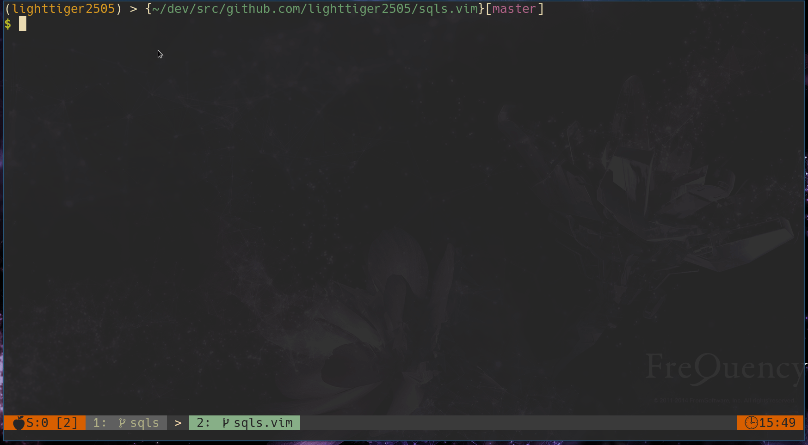

# sqls.vim

Vim plugin for [sqls](https://github.com/sqls-server/sqls)

## install

For vim-plug

```vim
Plug 'sqls-server/sqls.vim'
Plug 'prabirshrestha/vim-lsp'
Plug 'junegunn/fzf', { 'do': { -> fzf#install() } }
```

### depends

- [sqls](https://github.com/sqls-server/sqls)
- [vim-lsp](https://github.com/prabirshrestha/vim-lsp)
- [fzf](https://github.com/junegunn/fzf)

## Feature



| Commands                                            | Plug Mappings                       | Description                                                                  |
|-----------------------------------------------------|-------------------------------------|------------------------------------------------------------------------------|
| SqlsExecuteQuery                                    | <plug>(sqls-execute-query)          | execute query of the current buffer adn show query result to preview buffer. |
| SqlsExecuteQueryVertical                            | <plug>(sqls-execute-query-vertical) | ... display results vertically.                                              |
| SqlsShowConnections                                 | <plug>(sqls-show-connections)       | show database connection to preview buffer.                                  |
| SqlsShowDatabases                                   | <plug>(sqls-show-databases)         | show database to preview buffer.                                             |
| SqlsSwitchDatabase                                  | <plug>(sqls-switch-database)        | select and swith database. Requirement fzf.                                  |
| SqlsSwitchDatabase `<DB Name>`                      | -                                   | swith database.                                                              |
| SqlsSwitchConnection                                | <plug>(sqls-switch-connection)      | select and swith database connection. Requirement fzf.                       |
| SqlsSwitchConnection `<Connection Index>`           | -                                   | swith database connection.                                                   |
